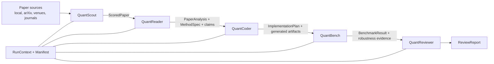
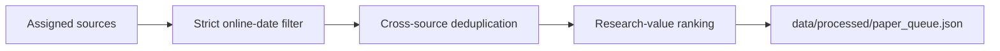

# QuantBench Crew

QuantBench Crew is a multi-agent research system for discovering quantitative
finance papers, reconstructing their methods and claims, generating auditable
implementation artifacts, benchmarking strategies, and issuing evidence-linked
research verdicts.

The project is built around statistical honesty:

- preserve the paper's exact claim and implementation uncertainty;
- keep temporal and point-in-time data discipline explicit;
- count generated candidates, baselines, seeds, and discarded trials;
- evaluate out of sample, net of costs, against simple and random nulls;
- deflate headline Sharpe ratios for selection bias;
- refuse confident conclusions when the evidence is placeholder, incomplete,
  or not reproducible.

QuantBench Crew supports research review only. It does not execute trades or
provide investment advice.

## Quick Start

```bash
# Create the recommended Python 3.11 environment.
conda env create -f environment.yml
conda activate quantbench-crew

# Run the deterministic offline workflow on two built-in sample papers.
quantbench run --source local --max-papers 2

# Inspect the outputs.
ls reports/
find runs -name manifest.json

# Run the default test suite.
pytest
```

The dry workflow needs no network access or API keys. It writes:

- `reports/<paper-slug>.md`: the human-readable review;
- `reports/<paper-slug>_strategy.py`: the selected generated strategy module;
- `runs/<run-id>/manifest.json`: the reproducibility and trial ledger;
- additional run artifacts under `runs/<run-id>/`.

For a deterministic fixture-driven paper:

```bash
quantbench run \
  --paper-json tests/fixtures/golden_paper.json \
  --max-papers 1
```

## System Overview

QuantBench Crew separates orchestration, executable capabilities, model
instructions, and evidence:

| Layer | Responsibility | Main location |
| --- | --- | --- |
| Agents | Own the five stages of the paper lifecycle | `src/quantbench_crew/agents/` |
| Runtime skills | Execute optional Python capabilities and record results | `src/quantbench_crew/skills/` |
| Agent Skills | Teach model backbones how to perform tasks and domain review | `skills/*/SKILL.md` |
| Tools and benchmarks | Search, sandbox code, load data, and compute evidence | `src/quantbench_crew/tools/`, `benchmarks/`, `datasets/` |
| Run manifest | Preserve skills, trials, LLM calls, seeds, and artifact hashes | `runs/<run-id>/manifest.json` |

Two principles shape the architecture:

1. **Agents orchestrate; skills perform bounded work.** Agent public methods
   remain stable while runtime skills can be enabled, disabled, or replaced.
2. **Evidence survives every handoff.** The final reviewer should be able to
   trace a statement to paper evidence, a skill result, a benchmark artifact,
   or a manifest entry.

## Orchestration Schema

### Paper Review Workflow

Each selected paper passes through five agents:



The main loop lives in
[`src/quantbench_crew/main.py`](src/quantbench_crew/main.py):

1. Discover or load papers.
2. Resolve each agent's enabled runtime skills from
   [`configs/agents.yaml`](configs/agents.yaml).
3. Rank papers with Scout.
4. Start one manifest-backed run per ranked paper.
5. Triage the paper and optionally stop before downstream spend.
6. Read and structure the paper.
7. Plan and generate a candidate implementation.
8. Benchmark and stress the method.
9. Compile the final evidence-linked review.
10. Hash and save the run artifacts.

### Agent Responsibilities

| Agent | Input | Core responsibility | Output |
| --- | --- | --- | --- |
| **QuantScout** | Candidate `Paper` records | Rank by keywords, charter fit, research value, and reproducibility feasibility | `ScoredPaper`, relevance and triage evidence |
| **QuantReader** | Paper metadata, abstract, and optional full text | Reconstruct the question, method, empirical design, claims, assumptions, and threats | `PaperAnalysis`, `MethodSpec`, `ReproductionTarget` |
| **QuantCoder** | Structured paper analysis | Turn the extracted method into an implementation plan and sandbox-tested strategy candidates | `ImplementationPlan`, generated code and candidate ledger |
| **QuantBench** | Plan, extracted claims, configured dataset | Run walk-forward evaluation, baselines, costs, selection-bias corrections, and robustness checks | `BenchmarkResult`, experiment and robustness artifacts |
| **QuantReviewer** | Analysis, plan, and benchmark evidence | Compare claims with results and issue a conservative, evidence-linked verdict | `ReviewReport` |

### Core Data Contracts

The orchestration passes frozen dataclasses rather than loose prose:

```text
Paper
  -> ScoredPaper
  -> PaperAnalysis
       -> MethodSpec
       -> ReproductionTarget / Claim
       -> empirical and critique assessments
  -> ImplementationPlan
  -> BenchmarkResult
       -> ClaimComparison
       -> DeflatedSharpe
       -> StrategyEvaluation / RobustnessAudit
  -> ReviewReport
```

The most important boundary is the `MethodSpec`: it converts paper prose into
an implementable contract containing the universe, signal definition,
portfolio construction, frequency, holding period, sample, evaluation
protocol, data requirements, and hyperparameters.

Generated strategies implement the `Strategy` contract:

```python
class Strategy(Protocol):
    def fit(self, data: PanelData, train_end: date) -> None: ...
    def weights(self, data: PanelData, as_of: date) -> dict[str, float]: ...
```

`PanelData` is point-in-time by construction. A strategy must use only data
available on or before `as_of`.

### Current Coder-to-Bench Boundary

The Coder emits strategy modules and tests them in the sandbox for shape,
determinism, no-lookahead behavior, and construction invariants. Every
evaluated candidate is counted as a trial.

The current default `walk_forward` runtime skill evaluates a trusted named
strategy, usually reference momentum, parameterized by the extracted
`MethodSpec`. The repository also contains a sandboxed generated-strategy
backtest utility, but generated-code walk-forward is not yet the default
orchestration path. Reports should therefore distinguish:

- generated implementation quality;
- trusted-strategy benchmark evidence;
- paper-claim reproduction evidence.

### Paper Tracking Workflow

`quantbench track` is a lighter Scout-only workflow for maintaining a durable
research queue:



It preserves prior human status and notes when updating the queue.

## Skills: Two Complementary Systems

The repository uses the word **skill** for two related but distinct systems.

### 1. Runtime Python Skills

Runtime skills are executable plug-ins implementing:

```python
class Skill(Protocol):
    name: str

    def available(self) -> bool: ...
    def run(self, ctx: RunContext, **inputs: Any) -> SkillResult: ...
```

They are registered in
[`src/quantbench_crew/skills/__init__.py`](src/quantbench_crew/skills/__init__.py),
toggled under `agents.<agent>.skills` in
[`configs/agents.yaml`](configs/agents.yaml), and invoked by an owning agent.
Every invocation records a `SkillResult` in the run manifest.

Most runtime skills are disabled in the shipped config. `code_generation` and
`metric_synthesis` are enabled by default and remain offline-safe.

#### Scout Runtime Skills

| Skill | Default | Purpose |
| --- | --- | --- |
| `charter_relevance` | off | Score papers against the configured research charter |
| `relevance_scorer` | off | Rank by charter fit, evidence, implementability, economics, and information gain |
| `reproducibility_triage` | off | Classify data access and gate low-feasibility papers before downstream spend |

The Scout config also declares disabled `arxiv_search` as a future-capability
placeholder. It is not currently a registered runtime skill; live arXiv
discovery runs through the source adapter in `tools/arxiv_tool.py`.

#### Reader Runtime Skills

| Skill | Default | Purpose |
| --- | --- | --- |
| `pdf_acquisition` | off | Cache an available paper PDF under `data/raw/` |
| `question_identifier` | off | Extract the central question, field state, gap, and contribution |
| `methodology_extractor` | off | Reconstruct equations, algorithms, settings, and baselines |
| `empirical_spec_parser` | off | Parse datasets, features, labels, preprocessing, splits, and metrics |
| `criticizer` | off | Separate assumptions, stated limitations, inferred threats, and open questions |
| `method_spec_extraction` | off | Produce the implementable `MethodSpec` |
| `target_table_extraction` | off | Convert quantitative headline claims into a `ReproductionTarget` |
| `red_flag_scan` | off | Detect costs, tuning, survivorship, microcap, sample, and snooping risks |

#### Coder Runtime Skills

| Skill | Default | Purpose |
| --- | --- | --- |
| `code_generation` | **on** | Run bounded ERA search over sandbox-tested candidate strategy modules |
| `metric_synthesis` | **on** | Generate and validate paper-claimed metrics absent from the built-in suite |
| `consult_reader` | off | Ask Reader to resolve performance-affecting `MethodSpec` gaps before coding |

#### Bench Runtime Skills

| Skill | Default | Purpose |
| --- | --- | --- |
| `dataset_registry` | off | Load, version, hash, and record the configured dataset |
| `walk_forward` | off | Run purged and embargoed out-of-sample evaluation with baselines and costs |
| `strategy_evaluator` | off | Test declared signal and no-signal datasets against expected behavior |
| `robustness_auditor` | off | Preserve a stress-test ledger across costs, parameters, paths, and datasets |

#### Reviewer Runtime Skills

| Skill | Default | Purpose |
| --- | --- | --- |
| `rubric_verdict` | off | Score reproducibility, robustness, costs, novelty, and data accessibility |
| `claims_vs_results_analyzer` | off | Compare every extracted claim with achieved evidence |
| `report_compiler` | off | Compile the comprehensive evidence-linked Markdown review |

### 2. Open-Format Agent Skills

Open-format Agent Skills are instruction bundles under [`skills/`](skills/).
Each skill is a folder containing a required `SKILL.md` with YAML metadata and
instructions, plus optional `references/`, `scripts/`, `assets/`, and
`agents/openai.yaml`.

They guide model behavior; they are not Python runtime plug-ins.

#### Core Agent Skills

These five skills define the stable role discipline injected into each
agent's model calls:

| Skill | Role |
| --- | --- |
| [`quant-scout`](skills/quant-scout/SKILL.md) | Date-bounded discovery, charter-relative ranking, and reproducibility triage |
| [`quant-reader`](skills/quant-reader/SKILL.md) | Source-grounded question, method, empirical-design, and claim extraction |
| [`quant-coder`](skills/quant-coder/SKILL.md) | Deterministic, sandbox-safe Strategy and PanelData implementation |
| [`quant-bench`](skills/quant-bench/SKILL.md) | OOS benchmark interpretation, null comparison, deflated Sharpe, and provenance |
| [`quant-reviewer`](skills/quant-reviewer/SKILL.md) | Evidence-linked red-team review and verdict discipline |

#### Task-Focused Skills

| Area | Skills |
| --- | --- |
| Scout | [`new-paper-tracker`](skills/new-paper-tracker/SKILL.md), [`relevance-scorer`](skills/relevance-scorer/SKILL.md) |
| Reader | [`question-identifier`](skills/question-identifier/SKILL.md), [`methodology-extractor`](skills/methodology-extractor/SKILL.md), [`empirical-spec-parser`](skills/empirical-spec-parser/SKILL.md), [`criticizer`](skills/criticizer/SKILL.md) |
| Coder | [`strategy-implementer`](skills/strategy-implementer/SKILL.md), [`backtest-pitfall-guard`](skills/backtest-pitfall-guard/SKILL.md), [`consult-reader`](skills/consult-reader/SKILL.md), [`coder-source-grounding`](skills/coder-source-grounding/SKILL.md), [`coder-doubt-driven`](skills/coder-doubt-driven/SKILL.md), [`coder-test-first`](skills/coder-test-first/SKILL.md), [`coder-incremental-implementation`](skills/coder-incremental-implementation/SKILL.md), [`coder-debugging-recovery`](skills/coder-debugging-recovery/SKILL.md), [`coder-self-review`](skills/coder-self-review/SKILL.md) |
| Bench | [`strategy-evaluator`](skills/strategy-evaluator/SKILL.md), [`robustness-auditor`](skills/robustness-auditor/SKILL.md) |
| Reviewer | [`claims-vs-results-analyzer`](skills/claims-vs-results-analyzer/SKILL.md), [`report-compiler`](skills/report-compiler/SKILL.md) |

The Coder also has access to the vendored engineering skill library under
[`skills/engineering/`](skills/engineering/README.md).

#### Domain Reader Skills

Domain readers provide progressive-disclosure expertise for specialized
papers. They are intended for Scout routing, Reader extraction, and Reviewer
critique when a skill-supporting host discovers them.

| Skill | Domain focus |
| --- | --- |
| [`factor-reader`](skills/factor-reader/SKILL.md) | Cross-sectional factors, anomalies, factor alpha, costs, and post-publication decay |
| [`macro-and-rates-reader`](skills/macro-and-rates-reader/SKILL.md) | Macro, fixed income, monetary policy, yield curves, and rates strategies |
| [`microstructure-reader`](skills/microstructure-reader/SKILL.md) | Tick data, order books, market making, execution, impact, and venue mechanics |
| [`options-reader`](skills/options-reader/SKILL.md) | Options, volatility surfaces, exotics, pricing, calibration, and hedging |
| [`optimization-reader`](skills/optimization-reader/SKILL.md) | Financial optimization, constraints, uncertainty, solvers, and validation |
| [`ml-in-finance-reader`](skills/ml-in-finance-reader/SKILL.md) | ML/DL for markets, temporal leakage, low-signal overfitting, foundation models, generative and graph models, agents, credible OOS Sharpe, and an 84-PDF reference corpus |

See [`skills/README.md`](skills/README.md) for the complete skills catalog and
consumption details.

### How Agent Skills Are Consumed

The top-level `llm.skills_dir` config controls the Agent Skills root.

- **API mode**, the default: the five core agent `SKILL.md` bodies are
  prepended to their model system prompts.
- **Harness mode**: an agent-host CLI receives the composed prompt and can
  additionally discover relevant task and domain skills natively.
- **Progressive disclosure**: task and domain skills remain available without
  being injected into every unrelated call.

Set `llm.skills_dir: ""` to disable core Agent Skill injection.

## LLM and Fallback Orchestration

Every LLM call routes through the provider-agnostic seam in
[`src/quantbench_crew/llm.py`](src/quantbench_crew/llm.py).

The shipped config uses per-agent providers:

| Agent | Default provider | Environment variable |
| --- | --- | --- |
| Scout | Grok / xAI | `XAI_API_KEY` or `GROK_API_KEY` |
| Reader | Gemini | `GEMINI_API_KEY` or `GOOGLE_API_KEY` |
| Coder | Anthropic Claude | `ANTHROPIC_API_KEY` or `ANTHROPIC_AUTH_TOKEN` |
| Bench | DeepSeek | `DEEPSEEK_API_KEY` |
| Reviewer | OpenAI | `OPENAI_API_KEY` |

Provider modes:

- `per-agent`: route each agent to its configured provider;
- `none`: force deterministic offline behavior;
- `stub`: replay recorded fixtures by request fingerprint;
- a provider name such as `openai` or `deepseek`: use one provider for all
  agents.

Missing credentials, unavailable optional dependencies, or failed live calls
fall back at the affected agent boundary. Other agents continue running.
Calls record provider, model, token counts, estimated cost, and request
fingerprint in the manifest. A shared per-paper `cost_cap_usd` bounds live
generation.

Copy [`.env.example`](.env.example) to see the supported API-key ports.

## Running Workflows

### Review Papers

```bash
quantbench run [options]
# Equivalent:
python -m quantbench_crew.main run [options]
```

Useful examples:

```bash
# Built-in local sample papers, fully offline.
quantbench run --source local --max-papers 2

# Local JSON paper records.
quantbench run --paper-json tests/fixtures/golden_paper.json --max-papers 1

# Live arXiv q-fin search.
quantbench run --source arxiv --query "cross-sectional momentum" --max-papers 5

# Search a venue or venue group.
quantbench run --source neurips --query "portfolio optimization" --year 2024
quantbench run --source journals --query-pool auto --max-papers 8

# Use a copied and edited agent configuration.
quantbench run \
  --paper-json tests/fixtures/golden_paper.json \
  --agents-config my-agents.yaml \
  --max-papers 1
```

Key `run` flags:

| Flag | Default | Purpose |
| --- | --- | --- |
| `--source` | `local` | Local records, arXiv, a conference, a journal, or a venue group |
| `--query` | `quantitative finance` | One search query for non-local sources |
| `--query-pool` | unset | Curated multi-query pool; mutually exclusive with `--query` |
| `--year` | unset | Restrict conference or journal search to a year |
| `--max-papers` | `2` | Maximum papers processed |
| `--paper-json` | unset | Local JSON list of paper records |
| `--agents-config` | `configs/agents.yaml` | Agent, skill, LLM, and charter config |
| `--benchmark-config` | `configs/benchmarks.yaml` | Benchmark defaults |
| `--runs-dir` | `runs` | Manifest and artifact root |
| `--report-dir` | `reports` | Human-readable report root |
| `--no-write-reports` | off | Print reports without writing `reports/` files |
| `--no-dedup` | off | Disable the persistent processed-paper watermark |

### Track New Papers

```bash
quantbench track \
  --start-date 2026-05-31 \
  --end-date 2026-06-10 \
  --source arxiv \
  --source journals \
  --query-pool auto
```

Tracking requires exact inclusive dates. Sources lacking a day-level online
date are reported separately rather than silently included.

### Browse Query Pools

```bash
quantbench queries
quantbench run --source conferences --query-pool auto --max-papers 16
quantbench run --source jfe --query-pool finance/market-mechanics --max-papers 5
quantbench run --source neurips --query-pool core-ml/generative-synthetic --year 2024
```

Pools include finance, general AI, core ML, data mining, and broad root terms.
`auto` selects a pool appropriate to each venue.

## Paper Sources

Supported sources include:

- local JSON records and built-in sample papers;
- arXiv q-fin categories;
- conferences: KDD, ICML, ICLR, WSDM, AAAI, IJCAI, WWW, NeurIPS;
- journals: Journal of Finance, Journal of Financial Economics, Review of
  Financial Studies;
- grouped sources: `conferences`, `journals`.

Conference search uses DBLP canonical venue streams and enriches DOI-linked
records through OpenAlex. Journal search uses OpenAlex metadata. Set
`OPENALEX_API_KEY` for useful quota.

When a live source is unavailable, adapters expose the failure and use
deterministic placeholders where supported. Placeholder evidence forces a
`scaffold-only` review rather than a research conclusion.

## Configuration

[`configs/agents.yaml`](configs/agents.yaml) is the main control plane. It
defines:

- per-agent roles and model providers;
- the research charter;
- runtime skill enablement and settings;
- code-generation budgets;
- walk-forward windows, embargo, costs, datasets, and robustness thresholds.

Enable a runtime skill by copying the config and changing its entry:

```yaml
agents:
  quant_bench:
    skills:
      dataset_registry:
        enabled: true
        dataset: planted_momentum
        params: {}
      walk_forward:
        enabled: true
        train_periods: 36
        test_periods: 12
        embargo: 1
        cost_bps: 10.0
```

Enabled runtime skills require a runs directory because their results and
artifacts are part of the reproducibility claim.

## Evidence, Artifacts, and Manifests

Each paper gets one run directory:

```text
runs/<run-id>/
  manifest.json
  report.md
  generated/
    strategy.py
    template_tests.py
    candidates.json
  benchmark/
    walk_forward.json
    strategy_evaluation.json
    robustness_audit.json
  review/
    claims_vs_results.json
    compiled_report.md
    compiled_report.json
```

`manifest.json` is always written for a manifest-backed run, and `report.md`
is written for completed reviews. Other artifacts appear only when their
owning stages and runtime skills execute.

The manifest records:

- config hash;
- every runtime `SkillResult`;
- every LLM call fingerprint, provider, model, tokens, and cost;
- seeds;
- artifact paths and SHA-256 hashes;
- a deterministic `content_hash` excluding volatile run identity fields.

The manifest is the run's reproducibility ledger. Failed and discarded trials
belong in it; hiding them would invalidate selection-bias corrections.

## Benchmarking Discipline

When the real Bench skills are enabled, QuantBench Crew evaluates a trusted
strategy through purged and embargoed walk-forward windows.

### Baselines and Nulls

The candidate is compared with:

- equal weight;
- buy and hold;
- a random matched-turnover null that pays comparable trading costs.

Beating the random matched-turnover null is the minimum evidence floor.

### Metrics

Metrics are frequency-aware and net of a linear turnover-cost model. The
built-in suite includes:

- mean return, volatility, Sharpe, annualized return;
- maximum drawdown, Calmar, Sortino, expected shortfall;
- directional accuracy, profit factor, and tail ratio;
- gross and net cumulative PnL;
- average turnover and position-distribution diagnostics.

Additional paper-claimed metrics can be synthesized by the Coder, sandbox
validated, and computed on the OOS return series.

### Statistical and Economic Checks

- **Deflated Sharpe** reads the full trial count from the manifest.
- **Factor spanning** can regress returns on FF5 plus momentum.
- **Capacity** provides a first-order turnover and liquidity sanity check.
- **Robustness** checks subsamples and parameter sensitivity.
- **Claim comparison** compares achieved metrics with extracted paper claims;
  tolerance bands are never optimization targets.
- **Strategy evaluation** can require success in planted-signal worlds and
  failure in pure-noise worlds.

## Code Generation and Sandbox

The Coder uses ERA-style Flat UCB search over candidate strategy modules.
Candidate quality is scored by deterministic template tests and a small
structural prior.

Before execution, generated code passes an AST gate. The sandbox blocks file
and network access, dangerous built-ins, unapproved imports, dunder access,
and unbounded host execution. It runs candidates in an isolated subprocess
with scrubbed environment variables and resource limits.

Template tests enforce:

- valid Strategy shape;
- deterministic output;
- no lookahead under future-data mutation;
- construction invariants such as long-short neutrality;
- finite weights and sensible warmup behavior.

Numeric imports such as numpy, pandas, and scikit-learn require the optional
numeric tier and explicit sandbox allowlisting.

## Datasets

The dataset registry hashes and versions every loaded dataset:

| Name | Source | Intended use |
| --- | --- | --- |
| `planted_momentum` | Synthetic | Positive control where momentum should work |
| `pure_noise` | Synthetic | Negative control where no strategy should reproduce |
| `french_momentum` | Kenneth French CSV | Public momentum portfolio benchmark |
| `crsp` | Local CRSP CIZ flat files | Point-in-time US equity evaluation |

Expected optional real-data paths:

```text
data/raw/french_momentum_monthly.csv
data/raw/stock/daily_stock_file_15-24.csv
data/raw/stock/delisting_information_15-24.csv
data/raw/ff_factors_monthly.csv
```

The CRSP loader compounds daily observations to monthly returns, retains
delisting information, applies configurable universe filters, and derives
price and volume characteristics without pandas.

Everything under `data/raw/` and `data/processed/` is gitignored.

## Installation

Recommended:

```bash
conda env create -f environment.yml
conda activate quantbench-crew
```

Minimal editable install:

```bash
python -m venv .venv
source .venv/bin/activate
pip install -e ".[dev]"
```

Optional tiers:

| Install | Enables |
| --- | --- |
| `pip install -e ".[paperqa]"` | PaperQA2 full-text reading |
| `pip install -e ".[numeric]"` | numpy, pandas, and scikit-learn paths |
| `pip install anthropic` | Live Anthropic provider |

Python 3.11 or newer is required.

## Tests and System Evaluation

```bash
pytest              # default suite; slow eval cases are deselected
pytest -m e2e       # end-to-end golden-paper and synthetic-noise gates
pytest -m eval      # curated system regression cases; may require CRSP
```

The curated evaluation set includes positive and negative controls. A useful
research system must find planted signal and also decline to reproduce pure
noise or fragile real-market results.

## Repository Layout

```text
configs/                    agent, skill, LLM, and benchmark configuration
data/raw|processed/         optional market data, caches, and research queue
docs/                       architecture and design notes
reports/                    human-readable reviews and exported strategies
runs/                       per-paper manifests and evidence artifacts
skills/                     open-format Agent Skills and reference corpora
src/quantbench_crew/
  agents/                   Scout, Reader, Coder, Bench, Reviewer, ERA search
  skills/                   executable runtime skill registry and implementations
  benchmarks/               contracts, protocols, metrics, statistics, sandbox backtest
  datasets/                 synthetic, French, CRSP, and evaluation datasets
  tools/                    search adapters, parsers, queue, and sandbox runner
  llm.py                    provider routing, fixtures, harness mode, and cost logging
  artifacts.py              manifest and content-hashed artifact store
tests/                      unit, integration, end-to-end, and eval tests
```

## Further Reading

- [`skills/README.md`](skills/README.md): complete Agent Skills catalog
- [`docs/coder-skills.md`](docs/coder-skills.md): Coder skill family
- [`docs/architecture.md`](docs/architecture.md): concise architecture note
- [`docs/skills-design.md`](docs/skills-design.md): runtime skill design
- [`docs/phase2-design.md`](docs/phase2-design.md): Phase 2 design and findings
- [`docs/phase2-status.md`](docs/phase2-status.md): implementation status

## Disclaimer

QuantBench Crew is a research-support tool. Outputs must be reviewed by
qualified human researchers before being used in any investment, trading,
risk-management, or production decision.
